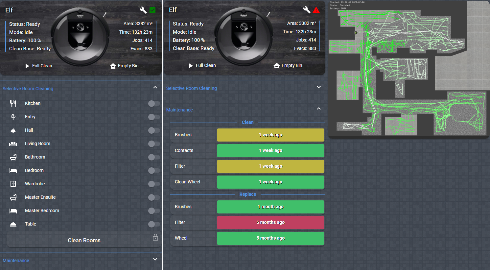

# ha-rest980-roomba

Home Assistant - iRobot Roomba i7+ Configuration using rest980

This repository provides configuration to get an iRobot Roomba i7+ robot vacuum cleaner integrated with Home Assistant using the rest980 Docker Image!

## Example Lovelace UI View



**Special Cheers** 
- **[Facu ZAK](https://github.com/koalazak)** for creating dorita980 and rest980 !
- **[gotschi](https://community.home-assistant.io/u/gotschi/summary)** for creating the original Roomba Map PHP file !

### Step 1: Get Robot Login Details

```
docker run -it node sh -c "npm install -g dorita980 && get-roomba-password <robotIP>"
```

If you dont have direct access to Docker (such as with Hass.io) you can clone and install the dorita980 package locally (requires git and node to be installed) - refer [here](https://github.com/koalazak/dorita980#how-to-get-your-usernameblid-and-password) for instructions

**Note:** Do not have iRobot App running on your phone when doing this !!!

### Step 2: Configure Vacuum Map
To allow the map to be correctly produced, you will need to create a new vacuum directory. I have chosen to put this inside the HA configuration directory, but you can choose to put this elsewhere and update the configuration accordingly (if you are using HASS and referencing my hass-addons repo, please leave this at the default!)

Copy the contents of the Vacuum directory from Github into this folder.

Note: The image.php file will need updating, but this will be done after the setup is complete.

### Step 3: Configure Docker Compose / Run Image / Hass.io Add-on
I use docker compose for all my HA related images, but have also listed the docker run command (copied from the rest980 github page)
I have also included an example PHP Docker Image which i use to host the map.

To allow this to work on Hass.io - I have created a custom github repository which can be added to Hass.io allowing the installation of the rest980 and nginx-php Docker Images (on amd64 systems only - as this is what the source image suports!)

**DOCKER-COMPOSE**
```
Refer docker-compose.yaml
```
**Note:** I use a separate docker bridged network which can be created with:
```
docker network create docker
```

**DOCKER RUN**
```
docker run -e BLID=myuser -e PASSWORD=mypass -e ROBOT_IP=myrobotIP -e FIRMWARE_VERSION=2 -p 3000:3000 koalazak/rest980:latest
docker run -p 3001:80 -v /<HA_CONFIG>/roomba:/app webhippie/php-nginx:latest
```

Confirm you can access the WebUI
```
http://<ip or fqdn of docker host>:<port>/api/local/info/state
```
**HASS.IO ADDON**

- Add the following Github Repository to your Hass.io Add-on Store
  https://github.com/jeremywillans/hass-addons
- Install the rest980 addon, then update and save the configuration options 
- Install and configure the php-nginx addon.
- Start rest980 and php-nginx

**Note**: You can also run this locally by creating a rest980 (or similar) folder within "addons/local" and then copying the config.json files from each folder on my [hass-addons](https://github.com/jeremywillans/hass-addons/) repository. 

This will create a new local addon which you can install

### Step 4: Get Room Details

* Initiate a Clean Rooms clean from the iRobot App, ensuring you select all **BUT** one room! (if you select them all, it wont list them out. Perform a second clean on the remaining room to get all the details)
* Navigate to ```http://<ip or fqdn of docker host>:<rest980port>/api/local/info/state```
* Look for the "lastCommand" section and copy down the following info 
-- pmap_id
-- user_pmapv_id
-- regions (as you selected all the rooms, they should all be listed here)

### Step 5: Configure Home Assistant Package and Secrets

I split off the ids and regions into the secrets file to make it easier to manage for future updates (as i expect these will change if you update your floorplan from the iRobot app)

#### secrets.yaml
```
Refer secrets.yaml
```

The below is my configuration YAML file which uses the [Packages](https://www.home-assistant.io/docs/configuration/packages/) feature in HA to keep all the separate components together.

I have tried to map as many of the reported statuses, however i occasionally get an "unknown" in the logs, if you work out another state, please post it up!

**Note:** The input_booleans and input_text entries all start with vacuum as this is used in the templates for correct mapping in lovelace

```
Refer vacuum.yaml
```

### Step 6: Configure Map Options

You will need to update the variables at the top of the image.php and image_dev.php to align with your environment.

Specifically the log, rest980, token and timezone ones should be done now - the rest are best to update once a full clean has run (to populate the map)

You can create the long-lived HA Token from you [HA Account Profile][profile] page.

### Step 7: Configure Lovelace

I have used the below lovelace configuration with the following HACS components

- lovelace-fold-entity-row
- button-card

Note: This config is taken directly from Lovelace Raw Editor as a complete view.

```
Refer lovelace.yaml
```

### Step 8: Update Map Options

After you have run a clean cycle, the map should be populating however it is unliekly not quite sized correctly.

In the Roomba directory (in HA Configuration), you will need to update the height, width, offset and flip options in the image.php file to correctly reflect your layout.

I have moved these as variables at the top of the file making it easier to update.

You will also need to replace the included floor.png file with an floor plan or similar file which is used as the background for the robot map.

**Note:** Once the vacuum has completed is clean, the image.php file references the latest.png file in the local directory so your changes wont be reflected upon refresh.
You can use the image-dev.php file as this has been updated to only create an in-memory copy of the map each time its refreshed.

### Step 9: Enjoy!

## Support

Got questions? Please post them [here][forum].

In case you've found a bug, please [open an issue on GitHub][issue].

[forum]: https://community.home-assistant.io/t/irobot-roomba-i7-configuration-using-rest980/161175
[issue]: https://github.com/jeremywillans/ha-rest9800-roomba/issues
[profile]: https://www.home-assistant.io/docs/authentication/#your-account-profile